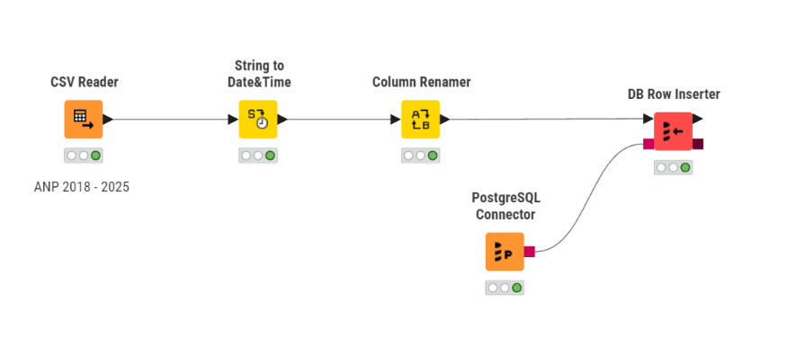

# InfoCombustível Brasil — Análise de Preços de Combustíveis (2018–2025)

Projeto de análise de dados de ponta a ponta sobre a evolução dos preços de combustíveis no Brasil, usando dados públicos da ANP. O objetivo foi construir um pipeline completo — da ingestão bruta até um dashboard executivo — capaz de responder perguntas de negócio reais: como os preços se comportaram ao longo do tempo, onde estão as maiores disparidades regionais e quando compensa abastecer com Etanol em vez de Gasolina.

**Autor:** Carlos Henrique Freitas  
**Fonte de dados:** [Série Histórica de Preços de Combustíveis e de GLP — ANP](https://www.gov.br/anp/pt-br/centrais-de-conteudo/dados-abertos/serie-historica-de-precos-de-combustiveis)  
**Período analisado:** 2018 a 2025

---

## Stack utilizada

| Etapa | Ferramenta |
|---|---|
| Ingestão de dados | KNIME |
| Armazenamento | PostgreSQL |
| Tratamento e Análise Exploratória (EDA) | Python (pandas, numpy, matplotlib, seaborn) |
| Visualização | Power BI |

---

## Arquitetura do Pipeline

```
CSV (ANP) → KNIME (ingestão) → PostgreSQL (tabela bruta)
                                       │
                                       ▼
                            Python (EDA + higienização)
                                       │
                                       ▼
                     PostgreSQL (view higienizada) → Power BI
```

A decisão de separar a tabela bruta (`anp.preco_combustivel_brasil`) de uma view higienizada (`vw_combustiveis_analise`) foi deliberada: o Power BI precisa consumir dados já limpos, mas o dado bruto permanece intacto no banco para qualquer reprocessamento futuro ou auditoria.

### 1. Ingestão (KNIME)

Fluxo `CSV Reader → String to Date&Time → Column Renamer → DB Row Inserter`, que lê os arquivos brutos da ANP e grava na tabela `anp.preco_combustivel_brasil` do PostgreSQL, conectando via `PostgreSQL Connector`.



📁 Arquivo do fluxo (`.knwf`) disponível em `docs/etl/etl_ingestao_anp.knwf`

### 2. Tratamento e Análise Exploratória (Python)

O notebook (`notebooks/eda_combustiveis.ipynb`) cobre:
- **Higienização:** identificação e remoção de 9.114 registros nulos nas colunas críticas (`produto`, `valor_venda`), mantendo nulos esperados em `complemento` e `valor_compra`.
- **Conversão de tipos:** `data_coleta` de `object` para `datetime64`, viabilizando agregações temporais.
- **EDA:** distribuição de preços por combustível, evolução temporal (2018–2025), disparidade geográfica por região/estado, e a métrica de paridade Etanol/Gasolina (regra dos 70%).

**Principais achados:**
- O Diesel atingiu pico de R$ 6,73/L em 2022, impulsionado por tensões geopolíticas no mercado internacional de petróleo.
- A Região Norte apresenta os maiores preços médios (ex.: AC a R$ 5,91/L) por custos logísticos; o RJ se destaca no Sudeste por alta carga tributária de ICMS.
- Nos estados produtores (MT, SP, GO, MG), o Etanol foi predominantemente mais vantajoso que a Gasolina ao longo da série, com exceção do choque atípico de 2021.

### 3. Visualização (Power BI)

Painel **InfoCombustível Brasil**, conectado à view higienizada, com:
- Cards de Big Numbers (preço médio por combustível), filtráveis por Ano, Bandeira, Combustível, Estado e Região.
- Gráfico de linha da evolução do preço médio por combustível (2018–2025).
- Heatmap de preço médio por Estado x Combustível.
- Gráficos de Preço Médio e Quantidade de Distribuidores por Região/Estado, com paleta de cores consistente para destacar a série/categoria principal.
- Tabela detalhada de coletas (região, estado, município, data, bandeira, combustível, valor).

📁 Ver `docs/img/` para prints do painel.

🔗 **Painel publicado:** [InfoCombustível Brasil](https://tinyurl.com/52nf6vf9)

---

## Como reproduzir

1. Baixe os dados brutos da ANP seguindo as instruções em `data/README.md`.
2. Crie a tabela no PostgreSQL com `sql/01_create_table.sql`.
3. Abra `docs/etl/etl_ingestao_anp.knwf` no KNIME e execute o fluxo para ingerir os dados.
4. Valide a carga com `sql/02_validacao_dados.sql`.
5. Copie `python/config.example.py` para `config.py` e preencha suas credenciais locais do PostgreSQL.
6. Instale as dependências: `pip install -r requirements.txt`
7. Execute o notebook `notebooks/eda_combustiveis.ipynb`.
8. Crie a view higienizada com `sql/03_create_vw_combustiveis_analise.sql`.
9. Abra `pbix/dashboard_combustiveis.pbix` no Power BI Desktop e aponte a conexão para sua instância do PostgreSQL.

---

## Estrutura do repositório

```
.
├── data/
│   └── README.md
├── docs/
│   ├── img/
│   └── etl/
│       └── etl_ingestao_anp.knwf
├── notebooks/
│   └── eda_combustiveis.ipynb
├── pbix/
│   └── dashboard_combustiveis.pbix
├── python/
│   └── config.example.py
├── sql/
│   ├── 01_create_table.sql
│   ├── 02_validacao_dados.sql
│   └── 03_create_vw_combustiveis_analise.sql
├── .gitignore
├── README.md
└── requirements.txt
```
